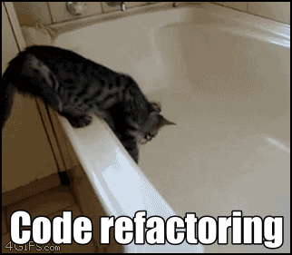
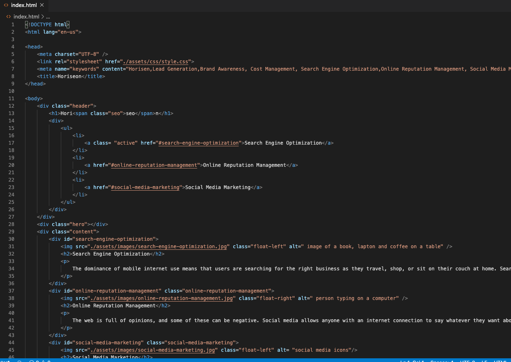
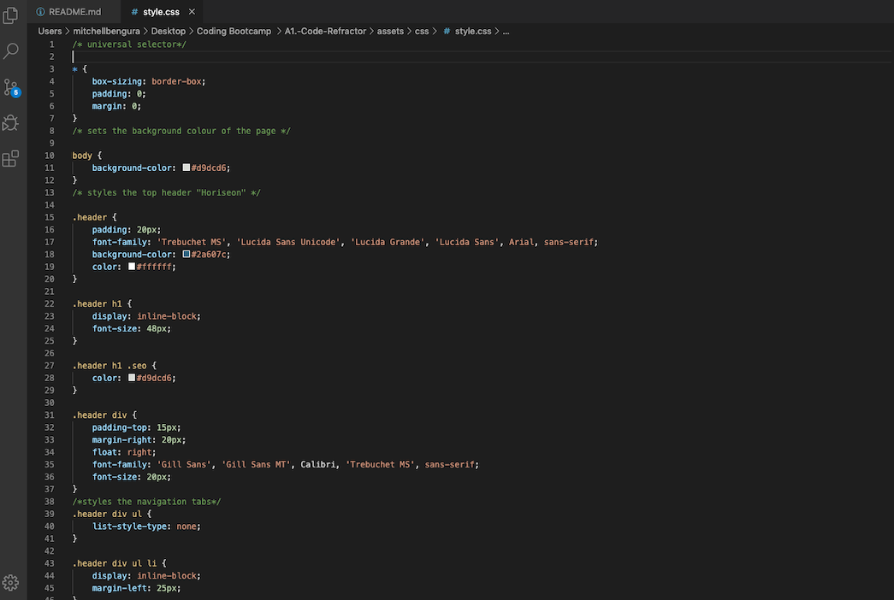

# Code Refactor #

## About The Project ## 

Using Accessibity Standards, the project aims to alter an existing webpage to make it accessible for users, including ensuring that people with disabilities or socio-economic restrictions have access to their website, and helping them avoid litigation.

## Code Refactor Screen Shot ##

### Image of the website ###

### Screenshot of the HTML Code ###

### Screenshot of the CSS Style ###

## Built With ##

    HTML 
    CSS 
    VS Code

### Installation ###

    Clone the repo

git clone https://github.com/Mitchelle-B/repo.git

## Contributing ##

    Fork the Project
    Create your Feature Branch (git checkout -b feature/AmazingFeature)
    Commit your Changes (git commit -m 'Add some AmazingFeature')
    Push to the Branch (git push origin feature/AmazingFeature)
    Open a Pull Request

## License ##

Distributed under the MIT License. See LICENSE for more information.
Contact

Project Link: https://github.com/Mitchelle-B/repo

## Acknowledgements ##

UWA Coding Bootcamp 